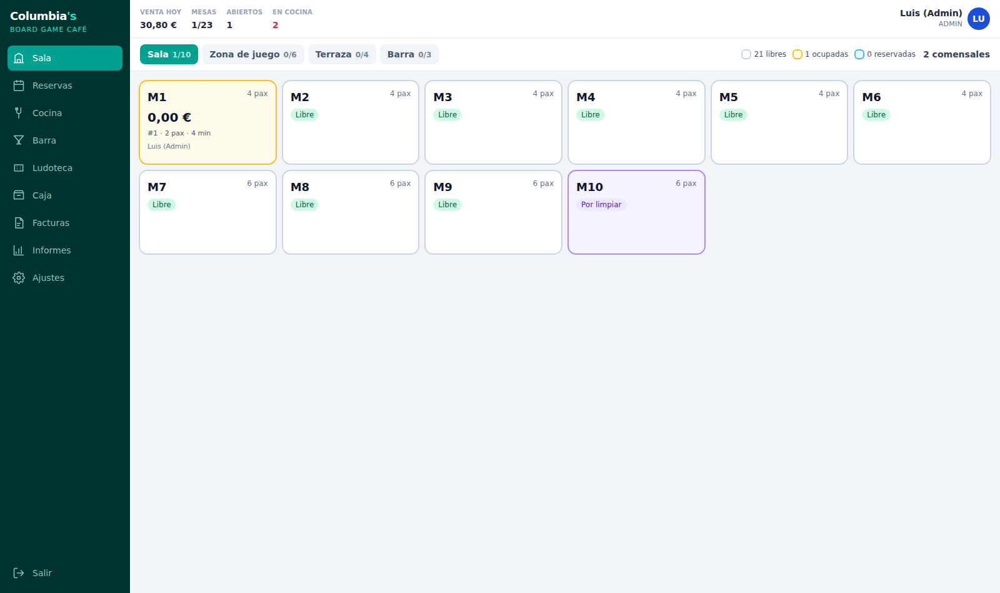

# Columbia's · Board Game Café

Software de gestión para el local: reservas, sala, TPV, cocina/barra, caja y
facturación. Pensado para funcionar en el PC del mostrador, con el datáfono
al lado para cobrar con tarjeta.



## Qué hace

| Módulo | Qué resuelve |
|---|---|
| **Autenticación** | Entrada por PIN en barra (rápida, sin teclado) o por email y contraseña para administración. Sesión con refresco automático. |
| **Reservas** | Alta por teléfono, web o local, con comprobación de solapamientos por mesa y sentado directo a pedido. |
| **Sala / Mesas** | Zonas (Sala, Zona de juego, Terraza, Barra), estado de cada mesa en vivo, unión de mesas para grupos grandes. |
| **Pedidos / TPV** | Carta completa con modificadores y alérgenos, comandas por rondas, descuentos, invitaciones, transferencia y división de cuenta. |
| **Cocina / Barra** | Pantallas de producción separadas, con tiempos de espera y aviso sonoro. Cada producto va a su destino automáticamente. |
| **Caja** | Apertura con fondo, entradas y salidas, arqueo por denominaciones y cierre Z con descuadre. |
| **Facturación** | Factura simplificada (ticket), completa con NIF y rectificativa. Recibo de 80 mm guardado en disco. |
| **Usuarios / Roles** | Cinco roles con matriz de permisos, y registro de auditoría de todo lo sensible. |
| **Ludoteca** | Catálogo de juegos con préstamo a mesa, y el cover fee del local (4 € consumiendo / 7 € solo jugar). |

## Puesta en marcha

Hace falta **Node.js 20 o superior** ([nodejs.org](https://nodejs.org), versión
LTS). Nada más: la base de datos es un fichero.

### En el PC del local (Windows)

Hay tres archivos para doble clic, sin tocar la consola:

| Archivo | Cuándo |
|---|---|
| `INSTALAR.bat` | Una sola vez, al montar el equipo. |
| `ARRANCAR.bat` | Al empezar el turno. Abre la aplicación en el navegador solo. |
| `COPIA-SEGURIDAD.bat` | Al cerrar el local. Guarda base de datos y recibos en `copias\<fecha>`. |
| `ACTUALIZAR.bat` | Cuando haya cambios nuevos que descargar. |
| `DESARROLLO.bat` | Solo para tocar el código: recarga sola al guardar. |

Al arrancar, la ventana negra escribe la dirección para las tablets
(`http://192.168.x.x:4000`). Todo va por un único puerto: mostrador, cocina y
barra.

Para que arranque solo al encender el PC: `Win + R`, escribe `shell:startup` y
deja ahí un acceso directo a `ARRANCAR.bat`.

> **Si usas PowerShell** y ves *«la ejecución de scripts está deshabilitada en
> este sistema»*, es una restricción de Windows con los scripts `.ps1`, no del
> proyecto. Escribe `npm.cmd` en vez de `npm` (`npm.cmd run setup`), o usa los
> `.bat` de arriba, que ya lo hacen. También puedes permitirlo de forma
> permanente para tu usuario con
> `Set-ExecutionPolicy -Scope CurrentUser RemoteSigned`.

### Desde la consola (cualquier sistema)

```bash
npm run setup     # instala, crea la base de datos y carga la carta
npm run dev       # arranca API (4000) y aplicación (5173)
```

Abre <http://localhost:5173> y entra con uno de estos PIN de ejemplo:

| PIN | Usuario | Rol |
|---|---|---|
| `1111` | Luis | Administrador |
| `2222` | Marta | Encargada |
| `3333` | Javi | Camarero |
| `4444` | Cocina | Cocina |
| `5555` | Barra | Barra |

> Cambia estos PIN antes de usarlo en el local, desde **Ajustes → Usuarios**.

Para producción:

```bash
npm run build
npm start         # sirve la API; el cliente queda en client/dist
```

## Cómo va un servicio

1. **Abrir caja** con el fondo inicial. Sin caja abierta no se puede cobrar en efectivo.
2. **Sala** → tocar una mesa libre → indicar comensales → se abre el pedido.
3. **TPV** → tocar productos. Si el producto tiene modificadores (punto de la
   carne, pan sin gluten, quitar ingredientes) se abre el selector.
4. **Cover** → botón «🎲 Cover» para cargar el acceso a la ludoteca por persona.
5. **Prestar juego** → deja el juego asociado a la mesa; al cobrar se devuelve solo.
6. **Enviar** → genera un ticket para cocina y otro para barra, según el destino
   de cada producto.
7. **Cobrar** → efectivo, tarjeta (anotando la referencia del datáfono), Bizum,
   o varios métodos a la vez. Se emite la factura y se guarda el recibo.
8. **Cerrar caja** → arqueo por billetes y monedas; el sistema calcula el descuadre.

## La carta

Está cargada en `server/prisma/seed.ts`: 13 categorías y 73 productos tomados
de la carta de referencia del proyecto, adaptando a la marca los productos que
llevaban el nombre del café original (`ClasSix` → `Columbia's Classic`,
`Six Club` → `Columbia's Club`, `Six Cookie` → `Columbia's Cookie`).

Cada producto lleva sus alérgenos de los 14 de declaración obligatoria, y las
marcas de vegano, picante y recomendado para niños. Todo es editable desde
**Ajustes → Carta** sin tocar código.

## Documentación

- [Tablets de cocina y barra](docs/tablets-cocina.md)
- [Arquitectura y decisiones](docs/arquitectura.md)
- [Facturación e IVA](docs/facturacion.md)
- [Roles y permisos](docs/roles-permisos.md)
- [Manual de uso](docs/guia-uso.md)

## Tecnologías

**Servidor:** Node.js · Fastify · Prisma · SQLite · Zod · Socket.IO · JWT
**Cliente:** React · TypeScript · Vite · TailwindCSS · TanStack Query · Zustand

La base de datos es SQLite en un fichero, que es lo adecuado para un local con
un puesto de cobro: no hay servidor de base de datos que administrar y la copia
de seguridad es copiar un archivo. El acceso a datos pasa por Prisma, así que
migrar a PostgreSQL el día que haya varios locales es cambiar el conector.

## Comprobaciones

```bash
npm test          # 40 pruebas: IVA, descuentos y servicio completo de una mesa
```
